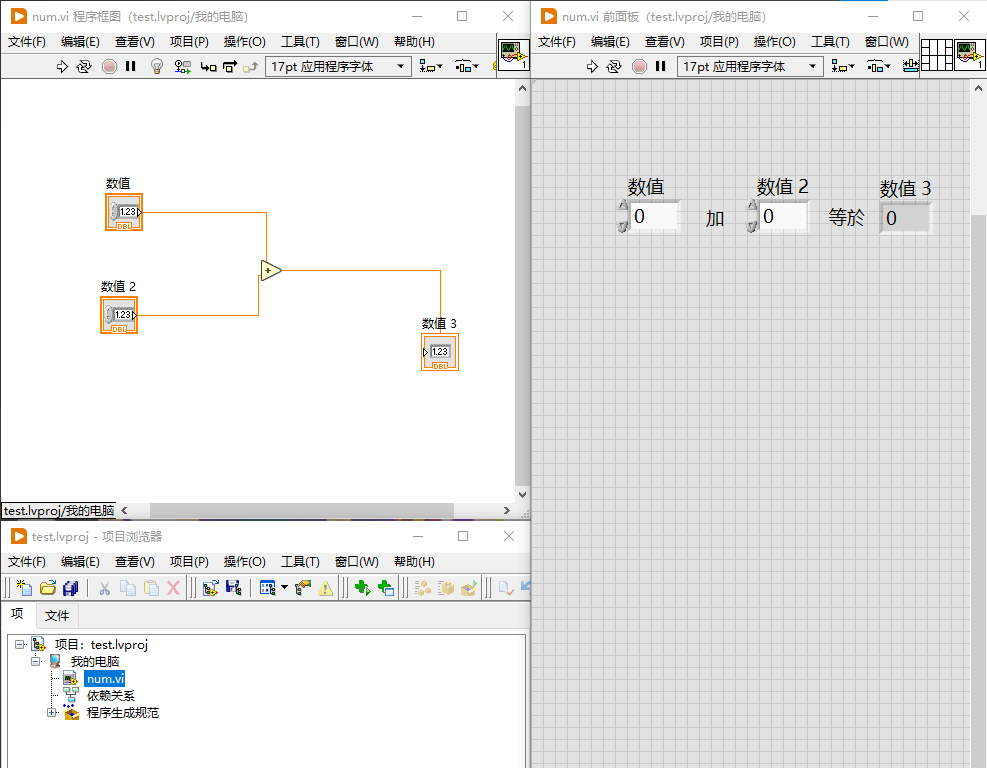
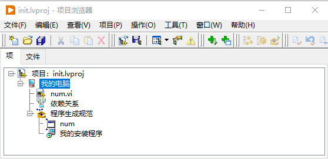

# TestLabViewBuildInstallFile

A LabVIEW project for testing and building executable files and installer packages.

## Overview

This project demonstrates how to build LabVIEW applications into executable files and create installer packages for distribution.

## Features

- Build self-executing executable files (.exe)
- Create installer packages for application distribution
- Test LabVIEW build and installation processes

## Build Options

### 1. Build Self-Executing Executable

The first option allows you to build a standalone executable file that can run independently without requiring LabVIEW runtime.



### 2. Build Installer Package

The second option creates an installer package that includes the application and all necessary dependencies for easy distribution and installation.



## Project Structure

```
TestLabViewBuildInstallFile/
├── install/          # Installation project files
│   ├── num.vi
│   ├── test.aliases
│   ├── test.lvlps
│   └── test.lvproj
├── installin/        # Installer initialization files
│   ├── init.aliases
│   ├── init.lvlps
│   ├── init.lvproj
│   └── num.vi
├── builds.zip        # Build output files
├── i1.png            # Screenshot: Build self-executing exe
├── i2.png            # Screenshot: Build installer exe
└── README.md         # This file
```

## Requirements

- LabVIEW (version compatible with project files)
- LabVIEW Application Builder (for creating executables)
- LabVIEW Installer Builder (for creating installer packages)

## Usage

1. Open the LabVIEW project file (`test.lvproj` or `init.lvproj`)
2. Configure build specifications according to your needs
3. Choose between building a self-executing exe or an installer package
4. Build and test the output files

## License

See [LICENSE](LICENSE) file for details.